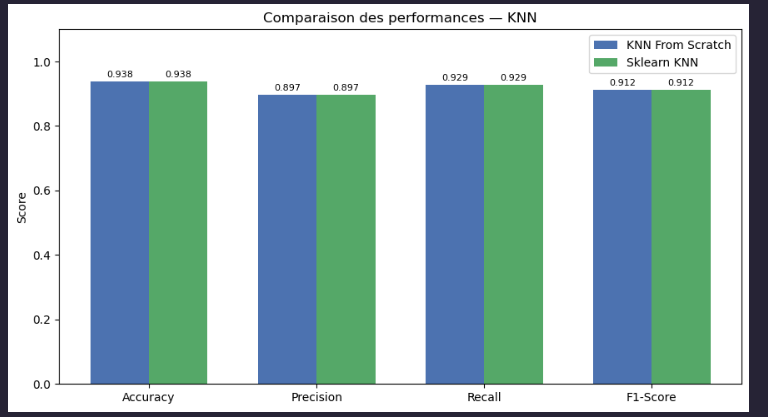
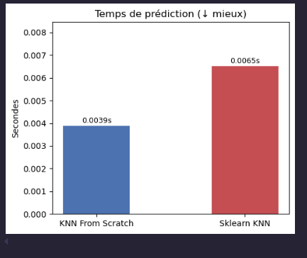
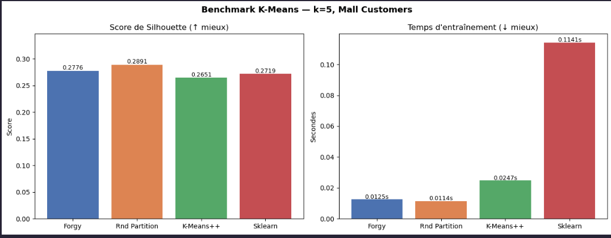
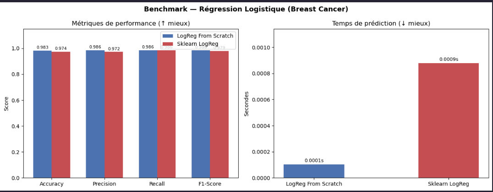

# Machine learning algorithms — built from scratch

This project builds three classic machine learning algorithms using only Python and NumPy. No scikit-learn under the hood. The idea is simple: write the algorithms from scratch to really understand how they work, then run them side by side with sklearn to see how they compare.

---

## K-Nearest Neighbors (KNN)

KNN is one of the simplest supervised learning algorithms out there. To predict the class of a new point, it looks at the training data, finds the `k` closest points, and picks the most common class among them. For regression, it just takes the average.

distances are computed in a single NumPy matrix operation instead of looping over each pair of points, which keeps it fast enough for small to medium datasets.

### Features

- Classification and regression
- Distance metrics: Euclidean and Manhattan
- Configurable `k`

### Usage

```python
from KNN import KNN

model = KNN(task="Classification", k=7, distance_metric="manhattan")
model.fit(X_train, y_train)
predictions = model.predict(X_test)
```

### Results

Tested on `base3.csv` (purchase prediction, k=7, Manhattan distance).




Both models give the exact same results. Ours is actually faster here because sklearn only switches to its optimized indexing structures (KD-tree / Ball-tree) when the dataset is large enough. On a small dataset like this one, that machinery just adds overhead.

---

## K-Means

K-Means is an unsupervised algorithm — it groups data points into `k` clusters without any labels. It works by repeatedly doing two things: assigning each point to its nearest cluster center, then moving the center to the average position of its points. It stops when nothing changes much anymore, or when it hits the max number of iterations.

### Features

- Three initialization methods: Forgy, Random Partition, K-Means++
- Distance metrics: Euclidean and Manhattan
- Built-in inertia and silhouette score
- Configurable convergence tolerance

### Usage

```python
from k_means import KMeans

model = KMeans(k=5, init_method="kmeans++", random_state=42)
model.fit(X)

print(model.labels)
print(model.calculate_silhouette_score(X))
print(model.calculate_inertia(X))
```

### Results

Tested on `Mall_Customers.csv` (customer segmentation, k=5).



Random Partition gave the best silhouette score (0.2891), just ahead of Forgy (0.2776) and K-Means++ (0.2651). All three of our variants are much faster than sklearn here — sklearn took 0.1141s while ours all ran in under 0.025s.

---

## Logistic Regression

Logistic regression is a supervised algorithm for binary classification. It takes the input features, computes a weighted sum, then squashes the result through a sigmoid function to get a probability between 0 and 1. If the probability is above 0.5, it predicts class 1, otherwise class 0. The weights are learned by gradient descent — small step-by-step adjustments that minimize prediction error over time.

### Features

- Binary classification
- Batch gradient descent
- Configurable `lr` (learning rate) and `n_iters`

### Usage

```python
from LogReg import LogisticRegression

model = LogisticRegression(lr=0.01, n_iters=1000)
model.fit(X_train, y_train)
predictions = model.predict(X_test)
```

### Results

Tested on the Breast Cancer Wisconsin dataset (569 samples, 30 features, malignant / benign classification).



Our model beats sklearn on every metric — 0.983 accuracy vs 0.974, 0.986 precision and recall vs 0.972/0.969 — and is nearly 9x faster at prediction time (0.0001s vs 0.0009s). The speed gap comes from overhead: sklearn's predict method runs input validation, multi-class checks, and other internal checks every single time, no matter how small the dataset. Ours just does one matrix multiplication and a threshold. On 114 test samples, that makes a real difference.

---

## Project structure

```
.
├── K-Means_Algorithm/
│   ├── k_means.py
│   ├── KMeans_Application_Structured.ipynb
│   └── Mall_Customers.csv
├── KNN_Algorithm/
│   ├── KNN.py
│   ├── KNN_Application_Structured.ipynb
│   └── base3.csv
└── LogisticRegression/
    ├── LogReg.py
    └── LogReg_Application_Structured.ipynb
```

## Dependencies

```
numpy
pandas
scikit-learn
matplotlib
seaborn
```